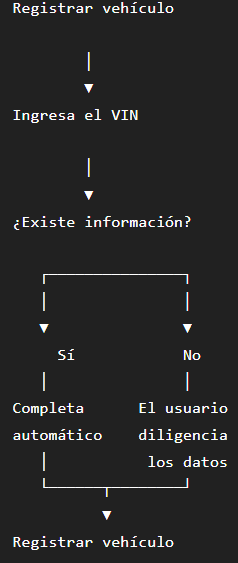

# 1. Consultar información por VIN

GET /api/v1/vehicles/vin/{vin}

## Request

```json
{
  "vin": "1HGCM82633A123456",
  "brand": "Honda",
  "model": "Civic",
  "year": 2022,
  "engine": "2.0",
  "fuelType": "Gasoline"
}
```

## Response 404

```json
{
  "code": "VIN_NOT_FOUND",
  "message": "No se encontró información para el VIN."
}
```

## Errores

| HTTP | Código             | Descripción                                        |
| ---- | ------------------ | -------------------------------------------------- |
| 400  | `VALIDATION_ERROR` | La solicitud contiene datos inválidos o faltantes. |

## 2. Registrar el vehículo

POST /api/v1/vehicles

```json
{
  "nickname": "Mi Mazda",
  "plate": "ABC123",
  "vin": "1HGCM82633A123456",
  "brand": "Mazda",
  "model": "CX-5",
  "year": 2023,
  "engine": "2.5",
  "fuelType": "GASOLINE",
  "transmission": "AUTOMATIC"
}
```

## Response 200

```json
{
  "vehicleId": "c8d2f4c1-3f8e-4b72-9d4d-1d3c1d8a8e11",
  "nickname": "Mi Mazda",
  "plate": "ABC123",
  "vin": "1HGCM82633A123456",
  "brand": "Mazda",
  "model": "CX-5",
  "year": 2023,
  "engine": "2.5",
  "fuelType": "GASOLINE",
  "transmission": "AUTOMATIC",
  "currentMileage": null,
  "mileageStatus": "PENDING_FIRST_OBD_READING",
  "createdAt": "2023-03-01T00:00:00.000Z",
  "updatedAt": "2023-03-01T00:00:00.000Z"
}
```

## Errores

| HTTP | Código                       | Descripción                                                                         |
| ---- | ---------------------------- | ----------------------------------------------------------------------------------- |
| 400  | `VALIDATION_ERROR`           | La solicitud contiene datos inválidos o faltantes.                                  |
| 401  | `INVALID_ACCESS_TOKEN`       | El Access Token no es válido.                                                       |
| 401  | `TOKEN_EXPIRED`              | El Access Token ha expirado.                                                        |
| 409  | `VEHICLE_ALREADY_REGISTERED` | El vehículo ya se encuentra registrado para el usuario.                             |
| 409  | `VIN_ALREADY_REGISTERED`     | El VIN ya está asociado a otro vehículo (si el negocio decide que el VIN es único). |
| 409  | `PLATE_ALREADY_REGISTERED`   | La placa ya está registrada para otro vehículo (si el negocio lo requiere).         |
| 500  | `INTERNAL_ERROR`             | Error interno del servidor.                                                         |

## 3. Consultar información de todos los vehículos

GET /api/v1/vehicles/

## Response 200

```json
[
  {
    "vehicleId": "550e8400-e29b-41d4-a716-446655440000",
    "nickname": "Mi Mazda",
    "plate": "ABC123",
    "brand": "Mazda",
    "model": "CX-5",
    "year": 2023,
    "currentMileage": null
  },
  {
    "vehicleId": "7e84a420-e29b-41d4-a716-446655449999",
    "nickname": "Toyota",
    "plate": "XYZ987",
    "brand": "Toyota",
    "model": "Hilux",
    "year": 2021,
    "currentMileage": 124580
  }
]
```

## Errores

| HTTP | Código                 | Descripción                   |
| ---- | ---------------------- | ----------------------------- |
| 401  | `INVALID_ACCESS_TOKEN` | El Access Token no es válido. |
| 401  | `TOKEN_EXPIRED`        | El Access Token ha expirado.  |
| 500  | `INTERNAL_ERROR`       | Error interno del servidor.   |

## 4. Consultar información de un vehículo en espefico

GET /api/v1/vehicles/{vehicleId}

## Response 200

```json
{
  "vehicleId": "550e8400-e29b-41d4-a716-446655440000",
  "nickname": "Mi Mazda",
  "plate": "ABC123",
  "vin": "1HGCM82633A123456",
  "brand": "Mazda",
  "model": "CX-5",
  "year": 2023,
  "engine": "2.5",
  "fuelType": "GASOLINE",
  "transmission": "AUTOMATIC",
  "currentMileage": null,
  "createdAt": "2026-06-20T14:30:00Z",
  "updatedAt": "2026-06-20T14:30:00Z"
}
```

## Errores

| HTTP | Código                  | Descripción                                      |
| ---- | ----------------------- | ------------------------------------------------ |
| 400  | `INVALID_VEHICLE_ID`    | El formato del `vehicleId` no es válido.         |
| 401  | `INVALID_ACCESS_TOKEN`  | El Access Token no es válido.                    |
| 401  | `TOKEN_EXPIRED`         | El Access Token ha expirado.                     |
| 403  | `VEHICLE_ACCESS_DENIED` | El vehículo no pertenece al usuario autenticado. |
| 404  | `VEHICLE_NOT_FOUND`     | No existe un vehículo con ese `vehicleId`.       |
| 500  | `INTERNAL_ERROR`        | Error interno del servidor.                      |

## 5. Actualizar información del vehículo

PUT /api/v1/vehicles/{vehicleId}

## Request

```json
{
  "nickname": "Carro Familiar",
  "plate": "XYZ789"
}
```

## Response 200

## Response 200

```json
{
  "vehicleId": "550e8400-e29b-41d4-a716-446655440000",
  "nickname": "Carro Familiar",
  "plate": "XYZ789",
  "vin": "1HGCM82633A123456",
  "brand": "Mazda",
  "model": "CX-5",
  "year": 2023,
  "engine": "2.5",
  "fuelType": "GASOLINE",
  "transmission": "AUTOMATIC",
  "currentMileage": 125430,
  "createdAt": "2026-06-20T14:30:00Z",
  "updatedAt": "2026-06-21T09:15:00Z"
}
```

## Errores

| HTTP | Código                     | Descripción                                                                 |
| ---- | -------------------------- | --------------------------------------------------------------------------- |
| 400  | `VALIDATION_ERROR`         | La solicitud contiene datos inválidos.                                      |
| 400  | `INVALID_VEHICLE_ID`       | El formato del `vehicleId` no es válido.                                    |
| 401  | `INVALID_ACCESS_TOKEN`     | El Access Token no es válido.                                               |
| 401  | `TOKEN_EXPIRED`            | El Access Token ha expirado.                                                |
| 403  | `VEHICLE_ACCESS_DENIED`    | El vehículo no pertenece al usuario autenticado.                            |
| 404  | `VEHICLE_NOT_FOUND`        | El vehículo no existe.                                                      |
| 409  | `PLATE_ALREADY_REGISTERED` | La placa ya está registrada para otro vehículo (si el negocio lo requiere). |
| 500  | `INTERNAL_ERROR`           | Error interno del servidor.                                                 |

## 6. Eliminar un vehículo

DELETE /api/v1/vehicles/{vehicleId}

## Response 200

```json
{
  "message": "Se eliminó correctamente el vehículo."
}
```

## Errores

| HTTP | Código                       | Descripción                                                    |
| ---- | ---------------------------- | -------------------------------------------------------------- |
| 400  | `INVALID_VEHICLE_ID`         | El formato del `vehicleId` no es válido.                       |
| 401  | `INVALID_ACCESS_TOKEN`       | El Access Token no es válido.                                  |
| 401  | `TOKEN_EXPIRED`              | El Access Token ha expirado.                                   |
| 403  | `VEHICLE_ACCESS_DENIED`      | El vehículo no pertenece al usuario autenticado.               |
| 404  | `VEHICLE_NOT_FOUND`          | No existe el vehículo solicitado.                              |
| 409  | `VEHICLE_HAS_ACTIVE_SESSION` | El vehículo tiene una sesión OBD activa y no puede eliminarse. |
| 500  | `INTERNAL_ERROR`             | Error interno del servidor.                                    |

## 7.
