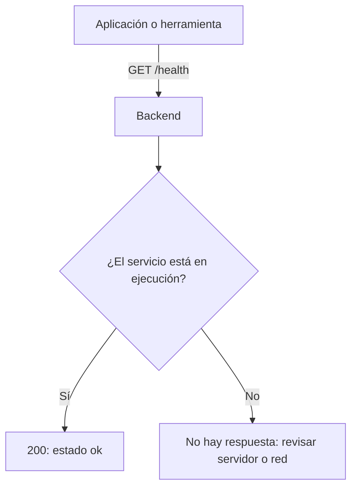
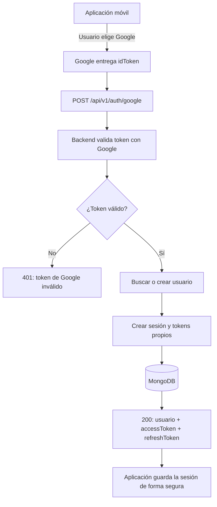
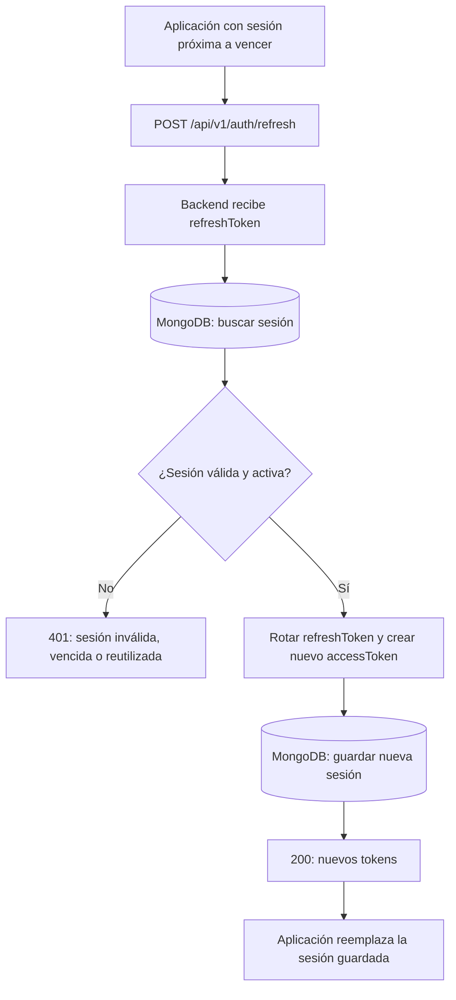
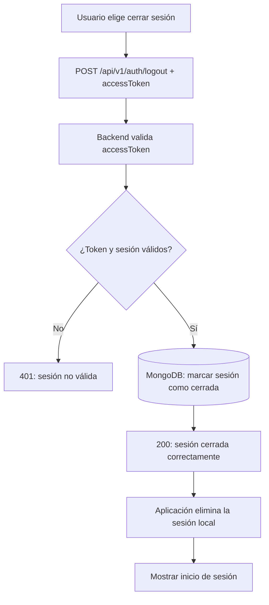
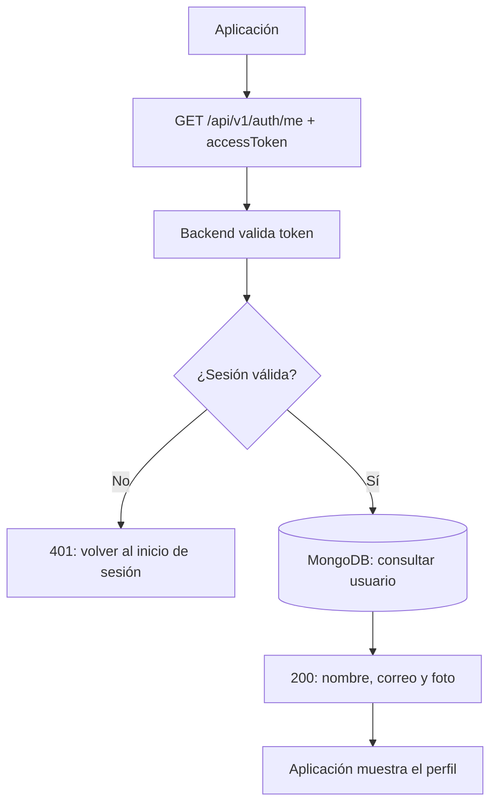
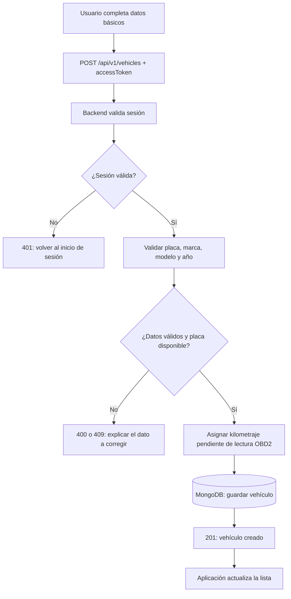
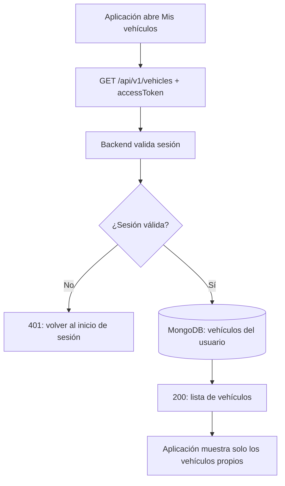

# Diagramas de flujo de rutas

## Propósito

Este documento muestra, de forma visual y editable, qué ocurre cuando una aplicación consume cada ruta disponible. Es la referencia de comunicación entre la aplicación móvil, el backend y la base de datos.

Los diagramas están escritos con **Mermaid**, por lo que GitHub los muestra como diagramas y cualquier integrante puede actualizar el texto directamente en este archivo. No son imágenes fijas.

**Última actualización:** 26 de septiembre de 2026.

## Cómo mantenerlo actualizado

Cuando se cree o cambie una ruta:

1. Actualizar su contrato en `openapi/openapi.yaml`.
2. Agregar o ajustar su diagrama en este archivo.
3. Actualizar la aplicación que consume la ruta.
4. Agregar o actualizar pruebas.

La regla es: una ruta nueva no se considera terminada si no tiene contrato, diagrama y prueba.

## Mapa de rutas actual

| Área | Ruta | Estado | Diagrama |
| --- | --- | --- | --- |
| Disponibilidad | `GET /health` | Disponible | [Ver flujo](#1-comprobar-el-servicio) |
| Autenticación | `POST /api/v1/auth/google` | Disponible | [Ver flujo](#2-iniciar-sesión-con-google) |
| Autenticación | `POST /api/v1/auth/refresh` | Disponible | [Ver flujo](#3-renovar-la-sesión) |
| Autenticación | `POST /api/v1/auth/logout` | Disponible | [Ver flujo](#4-cerrar-sesión) |
| Autenticación | `GET /api/v1/auth/me` | Disponible | [Ver flujo](#5-consultar-el-perfil-autenticado) |
| Vehículos | `POST /api/v1/vehicles` | Disponible | [Ver flujo](#6-registrar-un-vehículo) |
| Vehículos | `GET /api/v1/vehicles` | Disponible | [Ver flujo](#7-listar-los-vehículos-de-la-cuenta) |
| Vehículos | `GET /api/v1/vehicles/{vehicleId}` | Disponible | [Ver flujo](#8-consultar-un-vehículo) |
| Vehículos | `PATCH /api/v1/vehicles/{vehicleId}` | Disponible | [Ver flujo](#9-actualizar-información-básica-del-vehículo) |
| Vehículos | `PATCH /api/v1/vehicles/{vehicleId}/vin` | Disponible | [Ver flujo](#10-registrar-o-corregir-el-vin) |
| Administración | `PATCH /api/v1/admin/vehicles/{vehicleId}/plate` | Disponible | [Ver flujo](#11-corregir-una-placa-por-un-administrador) |

> Nota para arquitectura: las cuatro rutas de autenticación se encuentran implementadas en el backend y descritas en `docs/03-auth-service.md`. Su incorporación completa a `openapi/openapi.yaml` queda como tarea de sincronización documental.

---

## 1. Comprobar el servicio



## 2. Iniciar sesión con Google



## 3. Renovar la sesión



## 4. Cerrar sesión



## 5. Consultar el perfil autenticado



## 6. Registrar un vehículo



## 7. Listar los vehículos de la cuenta



## 8. Consultar un vehículo

```mermaid
flowchart TD
    A[Usuario toca un vehículo] --> B[GET /api/v1/vehicles/{vehicleId} + accessToken]
    B --> C[Backend valida sesión]
    C --> D[(MongoDB: buscar vehículo y propietario)]
    D --> E{¿Existe y pertenece a la cuenta?}
    E -->|No| F[404: vehículo no encontrado]
    E -->|Sí| G[200: detalle del vehículo]
    G --> H[Aplicación muestra el detalle]
```

## 9. Actualizar información básica del vehículo

```mermaid
flowchart TD
    A[Usuario edita datos básicos] --> B[PATCH /api/v1/vehicles/{vehicleId} + accessToken]
    B --> C[Backend valida sesión y propiedad]
    C --> D{¿Vehículo propio?}
    D -->|No| E[404: vehículo no encontrado]
    D -->|Sí| F[Validar nombre, marca, modelo y características]
    F --> G{¿Datos permitidos?}
    G -->|No| H[400: explicar el dato a corregir]
    G -->|Sí| I[(MongoDB: actualizar perfil del vehículo)]
    I --> J[200: vehículo actualizado]
    J --> K[Aplicación refresca el detalle]
```

## 10. Registrar o corregir el VIN

```mermaid
flowchart TD
    A[Usuario registra o corrige VIN] --> B[PATCH /api/v1/vehicles/{vehicleId}/vin + accessToken]
    B --> C[Backend valida sesión y propiedad]
    C --> D{¿Vehículo propio?}
    D -->|No| E[404: vehículo no encontrado]
    D -->|Sí| F{¿VIN vacío o de 17 caracteres válidos?}
    F -->|No| G[400: VIN inválido]
    F -->|Sí| H[(MongoDB: guardar VIN o null)]
    H --> I[200: vehículo actualizado]
    I --> J[Aplicación muestra el nuevo estado]
```

## 11. Corregir una placa por un administrador

```mermaid
flowchart TD
    A[Administrador reporta corrección] --> B[PATCH /api/v1/admin/vehicles/{vehicleId}/plate]
    B --> C[Backend valida sesión]
    C --> D{¿Correo incluido en ADMIN_EMAILS?}
    D -->|No| E[403: acceso administrativo requerido]
    D -->|Sí| F[Validar nueva placa y motivo]
    F --> G{¿Placa válida, diferente y disponible globalmente?}
    G -->|No| H[400 o 409: explicar corrección requerida]
    G -->|Sí| I[(MongoDB: actualizar placa y guardar auditoría)]
    I --> J[200: vehículo actualizado]
    J --> K[Historial conserva placa anterior, motivo y responsable]
```

## Próximo diagrama: lecturas OBD2

La siguiente ruta que se agregue para OBD2 deberá incluir su diagrama en esta sección. Antes de definirla se necesita confirmar el adaptador, el tipo de conexión compatible con iPhone y Android, y los datos exactos que puede entregar.
