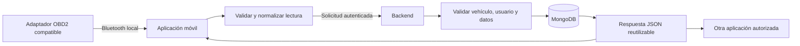

# Preparación de la integración OBD2

## Objetivo

Preparar la integración OBD2 sin asumir todavía un modelo de adaptador ni inventar lecturas. Este documento define la responsabilidad de cada parte para que el backend pueda servir a la aplicación móvil actual y a futuras aplicaciones autorizadas.

## Separación de responsabilidades

| Componente | Responsabilidad | No realiza |
| --- | --- | --- |
| Aplicación móvil | Conecta localmente al adaptador por Bluetooth, muestra el estado y convierte la lectura a un formato de datos. | No guarda secretos del servidor ni decide reglas globales de negocio. |
| Backend | Recibe datos normalizados, valida su estructura y relación con el vehículo, procesa reglas y devuelve información reutilizable por API. | No abre Bluetooth, no busca dispositivos cercanos y no depende de pantallas móviles. |
| Base de datos | Conserva únicamente lecturas que el backend haya validado. | No interpreta datos Bluetooth directamente. |

## Flujo futuro de una lectura

## Estados que mostrará la aplicación

La aplicación debe poder explicar el estado sin fingir una conexión:

| Estado | Significado para el usuario |
| --- | --- |
| Sin preparar | Aún no se seleccionó el vehículo o no se tiene adaptador compatible. |
| Listo para conectar | El vehículo está registrado; la app puede iniciar la búsqueda cuando exista el adaptador. |
| Buscando | Estado futuro mientras se buscan dispositivos Bluetooth. |
| Conectado | Estado futuro cuando el adaptador sea reconocido. |
| Leyendo | Estado futuro mientras se solicitan datos al vehículo. |
| Error | No se pudo conectar, no hubo respuesta o la lectura no es válida. |

## Decisiones pendientes antes de crear la ruta de lecturas

No se debe crear una ruta definitiva de OBD2 hasta confirmar:

1. Modelo exacto del adaptador.
2. Compatibilidad BLE con Android e iPhone.
3. Protocolos y comandos que el adaptador expone.
4. Datos que se pueden leer de manera confiable: kilometraje, códigos de error, combustible u otros.
5. Frecuencia de lectura y reglas para guardar historial.

Con esas respuestas se añadirá el contrato de lecturas a `openapi/openapi.yaml`, su diagrama a `08-diagramas-flujo-rutas.md`, el receptor en el backend y las pruebas correspondientes.
