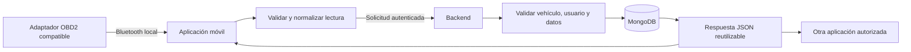

# Preparación de la integración OBD2

## Objetivo

Preparar la integración OBD2 sin asumir todavía un modelo de adaptador ni inventar lecturas. Este documento define la responsabilidad de cada parte para que el backend pueda servir a la aplicación móvil actual y a futuras aplicaciones autorizadas.

## Separación de responsabilidades

| Componente | Responsabilidad | No realiza |
| --- | --- | --- |
| Aplicación móvil | Conecta localmente al adaptador por Bluetooth, muestra el estado y convierte la lectura a un formato de datos. | No guarda secretos del servidor ni decide reglas globales de negocio. |
| Backend | Recibe datos normalizados, valida su estructura y relación con el vehículo, procesa reglas y devuelve información reutilizable por API. | No abre Bluetooth, no busca dispositivos cercanos y no depende de pantallas móviles. |
| Base de datos | Conserva únicamente lecturas que el backend haya validado. | No interpreta datos Bluetooth directamente. |

## Flujo futuro de una lectura

## Formato mínimo que preparará la aplicación

Cuando se conozca el adaptador, la aplicación no enviará datos Bluetooth en bruto al backend. Preparará una solicitud autenticada con un formato común. Así el backend podrá atender esta aplicación y otras aplicaciones autorizadas sin depender de una pantalla o de una marca de adaptador.

| Dato | Para qué sirve | Regla inicial |
| --- | --- | --- |
| `vehicleId` | Indica a qué vehículo pertenece la lectura. | Debe existir y pertenecer al usuario de la sesión. |
| `capturedAt` | Indica cuándo se obtuvo el dato. | Fecha y hora válida; no puede estar muy alejada de la hora del servidor. |
| `readings` | Contiene una o varias mediciones normalizadas. | Debe contener al menos una lectura reconocida. |
| `readings[].type` | Identifica el dato, por ejemplo `CURRENT_MILEAGE`, `DTC` o `FUEL_LEVEL`. | Solo se aceptarán tipos que se documenten para el adaptador confirmado. |
| `readings[].value` | Contiene el valor que informó el vehículo. | Debe corresponder al tipo de lectura y tener un formato válido. |
| `readings[].unit` | Aclara la unidad, cuando aplique: `km`, `%`, etc. | Debe ser compatible con el tipo de lectura. |
| `source` | Permite conocer el origen técnico de la lectura. | Será una identificación no secreta del adaptador o de la sesión local; no reemplaza la autenticación del usuario. |

El kilometraje solo se incluirá cuando el adaptador y el vehículo puedan entregarlo de forma confiable. No se asumirá que todos los adaptadores OBD2 pueden obtenerlo; mientras no exista esa confirmación, `currentMileage` continuará en `null` y el usuario no podrá escribirlo manualmente.

## Qué validará el backend

Antes de guardar una lectura, el backend verificará, en este orden:

1. Que la sesión del usuario sea válida.
2. Que el vehículo exista, esté activo y pertenezca al usuario.
3. Que la fecha de captura y la estructura de cada lectura sean válidas.
4. Que el tipo, el valor y la unidad estén permitidos para la integración confirmada.
5. Que el dato no sea claramente inconsistente, duplicado o anterior a una lectura más reciente cuando esa regla aplique.
6. Que solo se actualice el kilometraje actual con una lectura autorizada y válida.

La base de datos almacenará la lectura validada y el backend devolverá una respuesta reutilizable: identificador de la lectura, vehículo, datos aceptados, hora de registro y advertencias que la aplicación pueda mostrar. Nunca devolverá secretos, comandos Bluetooth ni credenciales del adaptador.

## Respuestas que debe poder entender la aplicación

| Resultado | Qué hará la aplicación |
| --- | --- |
| Lectura aceptada | Actualizará la información visible del vehículo con los datos confirmados por el backend. |
| Lectura rechazada por formato | Mostrará que el dato recibido no es válido y conservará el valor anterior. |
| Vehículo no disponible | Pedirá actualizar la lista; no guardará una lectura en un vehículo retirado o ajeno. |
| Sesión vencida | Pedirá iniciar sesión otra vez. |
| Adaptador sin el dato solicitado | Mostrará que ese dato no está disponible, sin inventar un valor. |
| Conexión interrumpida | Mostrará el problema local de Bluetooth y no afirmará que el backend recibió la lectura. |

## Estados que mostrará la aplicación

La aplicación debe poder explicar el estado sin fingir una conexión:

| Estado | Significado para el usuario |
| --- | --- |
| Sin preparar | Aún no se seleccionó el vehículo o no se tiene adaptador compatible. |
| Listo para conectar | El vehículo está registrado; la app puede iniciar la búsqueda cuando exista el adaptador. |
| Buscando | Estado futuro mientras se buscan dispositivos Bluetooth. |
| Conectado | Estado futuro cuando el adaptador sea reconocido. |
| Leyendo | Estado futuro mientras se solicitan datos al vehículo. |
| Error | No se pudo conectar, no hubo respuesta o la lectura no es válida. |

## Decisiones pendientes antes de crear la ruta de lecturas

No se debe crear una ruta definitiva de OBD2 hasta confirmar:

1. Modelo exacto del adaptador.
2. Compatibilidad BLE con Android e iPhone.
3. Protocolos y comandos que el adaptador expone.
4. Datos que se pueden leer de manera confiable: kilometraje, códigos de error, combustible u otros.
5. Frecuencia de lectura y reglas para guardar historial.

También se debe acordar qué lecturas iniciales entrarán en el primer alcance. La propuesta de trabajo es empezar únicamente con las que se puedan comprobar físicamente y añadir otras después, sin prometer kilometraje, códigos de error u otros datos que el adaptador real no entregue.

Con esas respuestas se añadirá el contrato de lecturas a `openapi/openapi.yaml`, su diagrama a `08-diagramas-flujo-rutas.md`, el receptor en el backend y las pruebas correspondientes.
